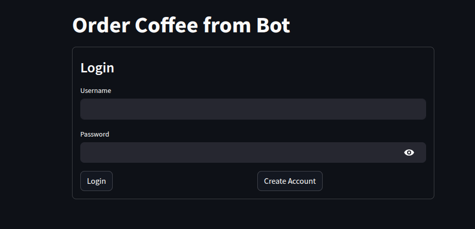

# ☕️ Coffee Agent

**LLM-powered multi-agent coffee shop assistant** built with FastAPI backend, Streamlit frontend, and local LLM (via Ollama). This system supports user interaction, coffee ordering, menu exploration, and smart recommendations — all through conversational chat.


---


## 🚀 Features

- 🔐 **User Authentication**  
  Register and log in securely via FastAPI APIs.

- 💬 **Conversational Chat Interface**  
  Interact with the assistant through a friendly Streamlit-based UI.

- 🧠 **Multi-Agent Architecture**  
  Modular agents handle classification, recommendations, order processing, and more — making the system highly maintainable and scalable.

- 🛒 **Direct Ordering via Chat**  
  Users can browse, customize, and order coffee products naturally through conversation.

- 💾 **Persistent Chat History**  
  All user interactions are stored in a PostgreSQL database for tracking and personalization.

- 🖥️ **Offline-First with Ollama**  
  Runs completely offline with local LLM models using [Ollama](https://ollama.com).

- 🐳 **Fully Dockerized Setup**  
  FastAPI, Streamlit, and PostgreSQL run in isolated containers with a unified Docker Compose setup.

- 🔍 **Product Search & Details Retrieval**  
  Ask for information about coffee items (e.g., origin, ingredients, taste notes) using intelligent semantic search powered by FAISS vector stores.

- 🎯 **Intent Classification**  
  Incoming user inputs are automatically routed to the correct agent using `classification_agent.py`.

- 📈 **Smart Recommendations**  
  Suggests items based on:
  - Apriori association rules (`apriori_recommendation.json`)
  - Popularity-based data (`popularity_recommendation.csv`)

- 🛡️ **Input Moderation & Validation**  
  All user queries are filtered and validated using `guard_agent.py` to ensure a safe, appropriate chat environment.

- 🔗 **RAG-Based Answering (Retrieval-Augmented Generation)**  
  The `details_agent.py` implements RAG by retrieving relevant product data from FAISS vector indexes and passing it to the LLM to generate contextually accurate answers.

- 📦 **Embedded Knowledge Base**  
  Uses FAISS indices (`faiss_product.index`, `bge_vector_store.index`) for fast, contextual product retrieval.

- 🔄 **Modular & Extendable Agent Protocols**  
  Easily add or modify agents via shared protocols defined in `agent_protocol.py`.

- 🧪 **Development Utilities**  
  Contains helper scripts in `development_code.py` for testing, extending, or debugging the application.

---

## 🧑‍💼 Agents Overview

The app is powered by **five intelligent agents**, each handling a specific task:

- `classification_agent.py` – Determines the user's intent (order, ask for details, etc.).
- `details_agent.py` – Provides detailed product information like ingredients or origin.
- `guard_agent.py` – Validates requests and filters inappropriate inputs.
- `order_taking_agent.py` – Handles item selection, customization, and order placement.
- `recommendation_agent.py` – Suggests items based on popularity or prior data (Apriori & popularity models).

---

## 📦 Dockerized Architecture

The app runs three containers within a shared network:

- `FastAPI` – Handles API and backend logic.
- `Streamlit` – Offers a chat UI interface for users.
- `PostgreSQL` – Stores user and chat data persistently.

---

## ⚙️ Requirements

- [Ollama](https://ollama.com) – For running local LLM models (e.g., llama3).
- [Docker](https://www.docker.com/) – For running FastAPI, Streamlit, and PostgreSQL in containers.

---

## 🛠️ Installation

```bash
# Step 1: Set up Ollama locally (https://ollama.com/)
# Step 2: Clone the repository
git clone https://github.com/nishantssoni/coffee_agent.git

# Step 3: Navigate into the project directory
cd coffee_agent
# NOTE: add .env in coffee_agent/ path
# Step 4: Run the containers
docker compose up
```

---

## 📁 File Structure
```plaintext
├── app
│   ├── agents                  # Modular LLM agents
│   │   ├── classification_agent.py
│   │   ├── details_agent.py
│   │   ├── guard_agent.py
│   │   ├── order_taking_agent.py
│   │   ├── recommendation_agent.py
│   │   ├── agent_protocol.py   # Base protocols/interfaces for agents
│   │   └── utils.py            # Helper functions
│   ├── config.py               # Environment/config variables
│   ├── database.py             # PostgreSQL integration
│   ├── development_code.py     # Dev utilities/scripts
│   ├── index_and_data          # FAISS & embedding stores
│   │   ├── bge_vector_store.index
│   │   ├── data.pkl
│   │   └── faiss_product.index
│   ├── models.py               # Pydantic/SQLAlchemy models
│   ├── oauth2.py               # Auth and token handling
│   ├── recommendation_objects  # Pre-built recommendation datasets
│   │   ├── apriori_recommendation.json
│   │   └── popularity_recommendation.csv
│   ├── routers                 # API routes
│   │   ├── auth.py
│   │   ├── chats.py
│   │   └── users.py
│   ├── schemas.py              # Pydantic schemas
│   └── utils.py                # General-purpose utilities
├── streamlit
│   ├── main.py                 # Streamlit chat UI app
│   ├── Dockerfile              # Streamlit container setup
│   └── requirements.txt
├── docker-compose.yml          # Defines multi-container setup
├── Dockerfile                  # FastAPI container setup
├── .env.example                # Sample environment file
```

---

## 📸 Screenshots

#### Login and Registration


#### Gaurd Agent


#### Details Agent


#### Popular recommendations


#### recommendations base on product


#### Product cart


---
- `classification_agent.py` – Determines the user's intent (order, ask for details, etc.).
- `details_agent.py` – Provides detailed product information like ingredients or origin.
- `guard_agent.py` – Validates requests and filters inappropriate inputs.
- `order_taking_agent.py` – Handles item selection, customization, and order placement.
- `recommendation_agent.py`


## 🛠️ Further Development

- 🧾 **Order Memory Extraction for Analytics or UI Display**  
  The `order_taking_agent.py` saves structured JSON responses with reasoning, step tracking, and itemized order summaries in the memory column in database. Example log output:

  ```json
  {
    "chain of thought": "The user has already ordered a Latte, so I will validate the new order. The user wants to order two more Lattes.",
    "step_number": 3,
    "order": [
      {"item": "Cappuccino", "quantity": 1, "price": "$4.50"},
      {"item": "Ginger Scone", "quantity": 1, "price": "$3.50"},
      {"item": "Latte", "quantity": 1, "price": "$4.75"},
      {"item": "Cappuccino", "quantity": 2, "price": "$9.00"}
    ],
    "response": "You have ordered a Cappuccino ($4.50), Ginger Scone ($3.50), Latte ($4.75), and two Cappuccinos ($9.00). Is there anything else you'd like to add?"
  }
  ```

- 🔄 **Access Chat History via API**  
  Call the following endpoint to retrieve all chat messages including embedded `memory`:

  ```
  GET /chats/history
  ```

  This is useful for pulling order data, reviewing interactions, or debugging multi-step conversations.

- 🧠 **Extract Last Order with `get_last_order_from_memory()`**  
  In the Streamlit frontend (`streamlit/main.py`), this helper function is available to extract the latest non-empty order from chat memory:

  ```python
  def get_last_order_from_memory(data):
      """Extract the most recent non-empty order from chat memory field."""
      for message in reversed(data):
          memory = message.get("memory", {})
          if (
              isinstance(memory, dict)
              and memory.get("agent") == "order_taking_agent"
              and memory.get("order")  # Ensures order exists and is not empty
          ):
              return memory["order"]
      return []
  ```

  - `data` is the list of chat messages (JSON) returned from `/chats/history`.
  - This function can be used to:
    - Show a live summary of the user’s current order
    - Enable "repeat last order" functionality
    - Integrate real-time receipt generation


## 🤝 Contribution
Contributions are welcome! Feel free to open issues or submit pull requests for suggestions, improvements, or bug fixes.

---

## 📜 License
This project is licensed under the MIT License. See the [LICENSE](./LICENSE) file for details.

---

## 📬 Contact
For any questions or feedback, please contact [iamnishantsoni4@gmail.com](mailto:iamnishantsoni4@gmail.com).

---

Let me know if you'd like help designing badges, screenshots, or adding GitHub Actions CI/CD setup.

